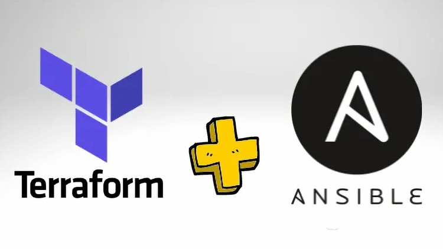

## Template to run AWS EC2 + Docker 🐋

### Requirements

- Terraform
- Ansible
- AWS Free Tier Account
- Unix based OS

### Steps

1. Create a key pair in AWS EC2 console
2. Populate the variables in `secret.tfvars` file
3. Populate the `PRIVATE_KEY_PATH` in the `Makefile`
4. Verify things like `ami`, `instance_type`, `region` in `variables.tf`
5. Run `make`